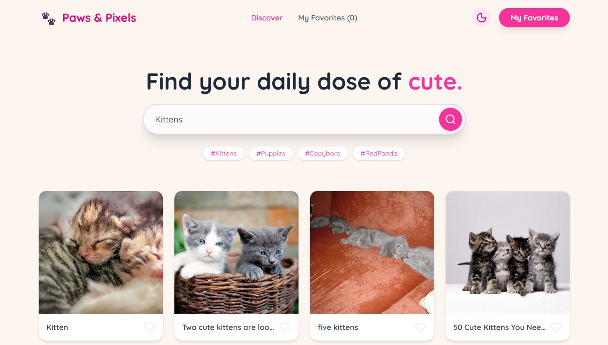
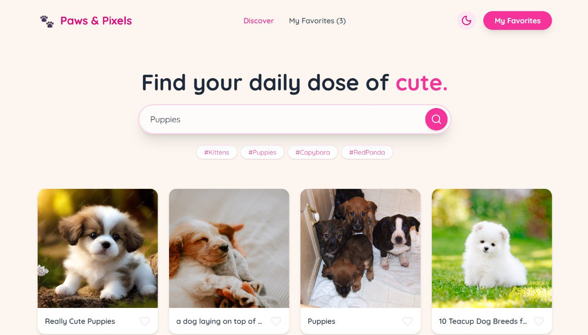
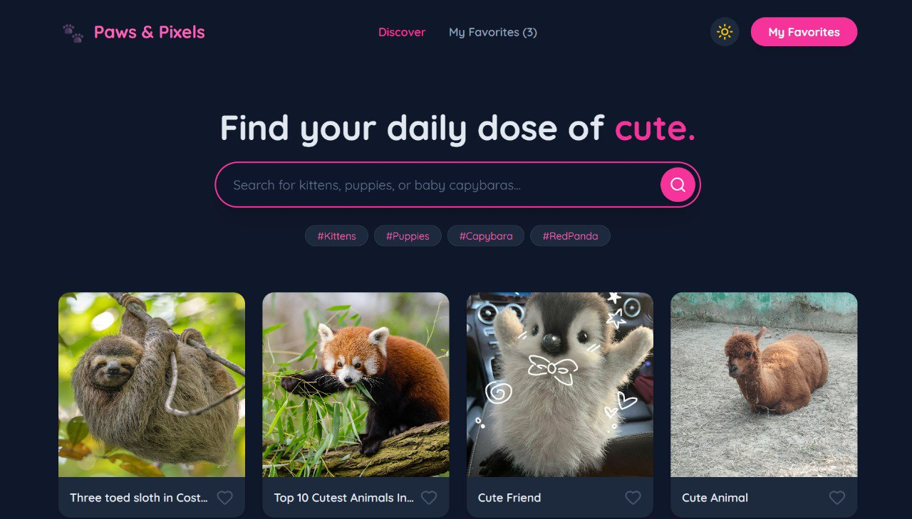
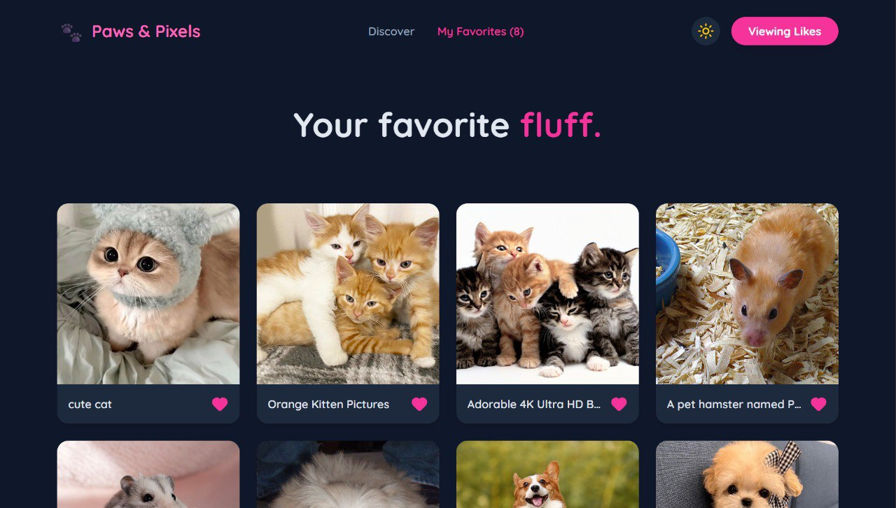

# Paws & Pixels | Cute Animal Search 🐾

Find your daily dose of cute. A high-performance, real-time animal discovery engine built with Next.js 16 and Tailwind v4.



## 🌟 Features

- **🚀 Real-Time Search:** Live internet discovery via SearXNG engine. Find kittens, puppies, or baby capybaras instantly.
- **💖 Persistent Favorites:** 'Heart' your top picks! Favorites are saved to `localStorage` and persist through refreshes.
- **🛡️ Zero-Space Error Handling:** Strict React protection logic. Broken image links are automatically detected and the entire card container is purged from the DOM to maintain UI integrity.
- **🖼️ HD Standards:** Forced 1080p resolution and 80% quality for all remote assets.
- **🌙 Midnight Kitten Mode:** Beautifully integrated dark mode toggle.
- **✨ Micro-interactions:** Fluid Framer Motion animations for cards and UI elements.

## 🛠️ Tech Stack

- **Framework:** Next.js 16 (App Router)
- **Styling:** Tailwind CSS v4
- **Animations:** Framer Motion
- **Icons:** Lucide React
- **Engine:** SearXNG Image Search API

## 🚀 Getting Started

### Prerequisites

- Node.js 24+
- pnpm

### Installation

1. Clone the repository:
   ```bash
   git clone https://github.com/CrimsonDevil333333/paws-pixels.git
   cd paws-pixels
   ```

2. Install dependencies:
   ```bash
   pnpm install
   ```

3. Run the development server:
   ```bash
   pnpm next dev
   ```

4. Build for production:
   ```bash
   pnpm build
   pnpm start
   ```

## 📸 Screenshots

| Kittens Search (Light) | Puppies Search (Light) | Discover (Dark) | My Favorites (Dark) |
|:---:|:---:|:---:|:---:|
|  |  |  |  |

---
Built with 💖 by Clawdy for Satyaa.
